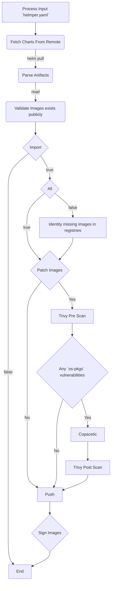
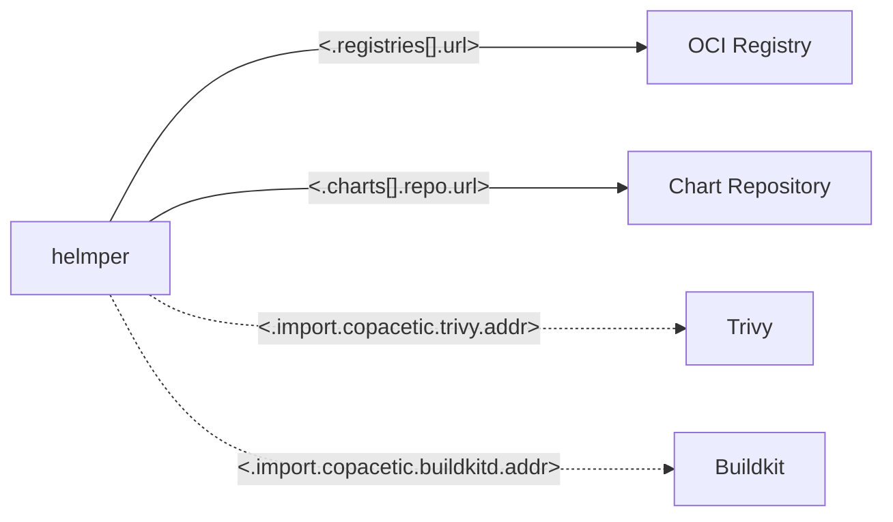
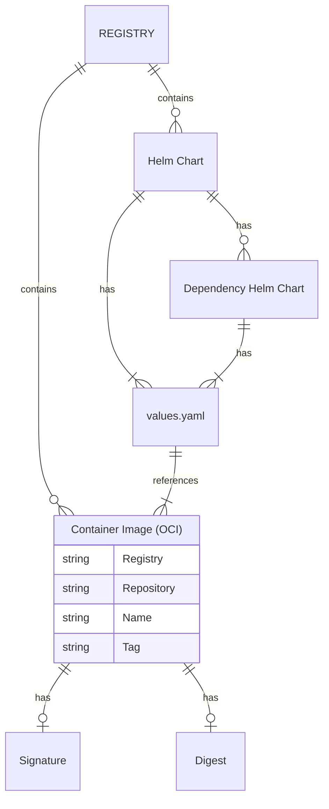

<p align="center">
  <a href="https://github.com/ChristofferNissen/helmper">
    
  </a>

  <p align="center">
    A little helper that reads Helm Charts and pushes the images to your registries.
    <br>
    <a href="https://github.com/ChristofferNissen/helmper/issues/new?template=bug.md">Report bug</a>
    ·
    <a href="https://github.com/ChristofferNissen/helmper/issues/new">Request feature</a>
    ·
    <a href="https://github.com/ChristofferNissen/helmper/releases">Releases</a>
    ·
    <a href="https://github.com/ChristofferNissen/helmper/releases/latest">Latest release</a>
  </p>

  [](https://goreportcard.com/report/github.com/ChristofferNissen/helmper) 
  [](https://github.com/ChristofferNissen/helmper/blob/main/LICENSE)

</p>

## What is Helmper?

_DISCLAIMER: helmper is in beta, so stuff may change._

`helmper` is a go program that reads Helm Charts from remote OCI registries and pushes the charts container images to your registries, with optional OS level vulnerability patching.

`helmper` is built with [Helm](<https://github.com/helm/helm>), [Oras](<https://github.com/oras-project/oras-go>), [Trivy](https://github.com/aquasecurity/trivy), [Copacetic](https://github.com/project-copacetic/copacetic) ([Buildkitd](https://github.com/moby/buildkitd)) and [Cosign](https://github.com/sigstore/cosign).

Helmper connects via gRPC to Trivy and Buildkit so you can run `helmper` without root privileges whereever you want. 

`helmper` demonstrates exceptional proficiency in operating within controlled environments that might require Change Management and/or air-gapped networks. This expertise is particularly beneficial in industries subject to stringent regulations, such as Medical and Banking. This is due to `helmper` ensures binary reproducibility of Helm Charts by storing all necessary artifacts in your registries.

`helmper` provides an interface to reduce the maintenance burden associated with managing a large collection of Helm Charts by:

- automatically detecting all enabled container images in charts
- providing an easy way to stay up to date on new chart releases
- providing option to only import new images, or all images
- enabling quick patching(and re-patching) of all images
- enabling signing of images was an integrated part of the process
- providing a mechanism to check requirements/dependencies before deploying charts with fx GitOps

### how?

#### Simple

Simply tell `helmper` which charts to analyze and registries to use by creating a `helmper.yaml` file and run helmper from the same folder.

```yaml
k8s_version: 1.27.9
import:
  enabled: true
charts:
- name: prometheus
  version: 25.8.0
  valuesFile: /workspace/in/values/prometheus/values.yaml # (Optional)
  repo:
    name: prometheus-community
    url: https://prometheus-community.github.io/helm-charts/
registries:
- name: registry
  url: 0.0.0.0:5000
  insecure: true
  plainHTTP: true
```

Helmper will import the charts, the charts listed as dependencies including all images specified through the Helm `values.yaml` file.

<p align="center"></p>

**Note** Authentication

Helmper utilizes well known configuration options to interact with registries. 

When using the Helm SDK, Helmper will utilize the file defined by `HELM_REGISTRY_CONFIG` for picking up authentication credentials for registries.

When Helmper is using Oras for interacting with OCI artifacts, Oras utilizes the [Docker credentials helper](https://pkg.go.dev/oras.land/oras-go/v2@v2.5.0/registry/remote/credentials), which will look in the system keychain, `$DOCKER_CONFIG/config.json` (if set) or `$HOME/.docker/config.json` file for picking up authentication credentials for all registries.

If your registries requires authentication, simply login with the services own login command.

fx for Docker:

```bash
docker login -u user -p pass
```

Azure:

```bash
az acr login -n myregistry
```

#### Full

In this example Helmper will also scan with Trivy, patch with Copacetic and sign with Cosign all identified images before pushing with Oras to all registries.

```yaml
k8s_version: 1.27.9
charts:
- name: prometheus
  version: 25.8.0
  valuesFile: /workspace/in/values/prometheus/values.yaml # (Optional)
  repo:
    name: prometheus-community
    url: https://prometheus-community.github.io/helm-charts/
registries:
- name: registry # `Helmper` picks up authentication from the environment automatically.
  url: 0.0.0.0:5000
  insecure: true
  plainHTTP: true
import:
  enabled: true
  copacetic:
    enabled: true
    ignoreErrors: true
    buildkitd:
      addr: tcp://0.0.0.0:8888
    trivy:
      addr: http://0.0.0.0:8887
      insecure: true
      ignoreUnfixed: true
    output:
      tars:
        folder: /workspace/.out/tars
        clean: true
      reports:
        folder: /workspace/.out/reports
        clean: true
  cosign:
    enabled: true
    keyRef: /workspace/.devcontainer/cosign.key
    KeyRefPass: ""
    allowInsecure: true
    allowHTTPRegistry: true
```

<p align="center"></p>

## Compatibility

Helmper utilizes the Helm SDK to maintain full compatibility with both Helm Repositories and OCI registries for storing Helm Charts.

In practice, Helmper currently pushes charts and images to the same destination registry, so it must be OCI compliant. 

Helmper utilizes `oras-go` to push OCI artifacts. Helmper utilizes the Helm SDK to push Helm Charts, as the Helm SDK sets the correct metadata attributes.

Oras and Helm state support all registries with OCI support, for example:

- [CNCF Distribution](https://oras.land/docs/compatible_oci_registries#cncf-distribution) - local/offline verification
- [Amazon Elastic Container Registry](https://docs.aws.amazon.com/AmazonECR/latest/userguide/push-oci-artifact.html)  
- [Azure Container Registry](https://docs.microsoft.com/azure/container-registry/container-registry-helm-repos#push-chart-to-registry-as-oci-artifact)
- [Google Artifact Registry](https://cloud.google.com/artifact-registry/docs/helm/manage-charts)
- [Docker Hub](https://docs.docker.com/docker-hub/oci-artifacts/)
- [Harbor](https://goharbor.io/docs/main/administration/user-defined-oci-artifact/)
- [Zot Registry](https://zotregistry.dev/)
- [GitHub Packages container registry](https://oras.land/docs/compatible_oci_registries#github-packages-container-registry-ghcr)
- [IBM Cloud Container Registry](https://cloud.ibm.com/docs/Registry?topic=Registry-registry_helm_charts)
- [JFrog Artifactory](https://jfrog.com/help/r/jfrog-artifactory-documentation/helm-oci-repositories)

Sources: [Helm](https://helm.sh/docs/topics/registries/#use-hosted-registries) [Oras](https://oras.land/docs/compatible_oci_registries)

For testing, Helmper is using the [CNCF Distribution]() registry.

## Install

Simply pick the binary for your platform from the Release section on GitHub.

### Linux

```bash
VERSION=$(curl -Lso /dev/null -w %{url_effective} https://github.com/christoffernissen/helmper/releases/latest | grep -o '[^/]*$')
curl -LO https://github.com/christoffernissen/helmper/releases/download/$VERSION/helmper-linux-amd64
chmod +x helmper-linux-amd64
sudo mv helmper-linux-amd64 /usr/local/bin/helmper
```

### Mac OS

```bash
VERSION=$(curl -Lso /dev/null -w %{url_effective} https://github.com/christoffernissen/helmper/releases/latest | grep -o '[^/]*$')
curl -LO https://github.com/christoffernissen/helmper/releases/download/$VERSION/helmper-darwin-amd64
chmod +x helmper-darwin-amd64
sudo mv helmper-darwin-amd64 /usr/local/bin/helmper
```

### Windows

Extract the tar and launch the exe file.

## Configuration

The configuration file `helmper.yaml` can be placed in: 

- Current directory (`.`)
- `$HOME/.config/helmper/`
- `/etc/helmper/`

Please see [Helmper configuration documentation](./CONFIG.md) for an detail overview of the different configuration options.

### Configuration options visualization

To understand how the different configuration options works, please study the flow diagram below



## Scope

### In scope

* Helmper operates with OCI compliant artifacts athennd OCI compliant registries.
* Helmper must remain without dependency on a container runtime daemon to work in containers without root privileges.

### Out of scope

* Helmper does not work with other Kubernetes package formats
* Helmper authenticates with registries with the docker config. There, Helmper will not have any propreitary libraries to facilitate authentication for any cloud providers. Simply use `docker login` or equivalent before running Helmper, and you should be authenticated for 3 hours for each registry.

## Roadmap

* Operator Framework to enable using Helmper with GitOps in management clusters
* Add option to import to registries via pipeline for compliance audit trail retention
* SBOM
* OpenTelemetry

## Development Environment

The project provides a devcontainer with a docker-compose.yml defining all required services.

### Docker

#### Registry

```bash
docker run -d -p 5000:5000 --restart=always --name registry registry:2
```

#### Buildkitd

```bash
export BUILDKIT_VERSION=v0.12.4
export BUILDKIT_PORT=8888
docker run --detach --rm --privileged \
-p 127.0.0.1:$BUILDKIT_PORT:$BUILDKIT_PORT/tcp \
--name buildkitd \
--entrypoint buildkitd \ 
"moby/buildkit:$BUILDKIT_VERSION" --addr tcp://0.0.0.0:$BUILDKIT_PORT
```

#### Trivy


```bash
docker run -d -p 8887:8887 --name trivy \
aquasec/trivy:0.50.4 server --listen=0.0.0.0:8887
```

## Diagrams

### Deployment Diagram / External services



This diagram illustrates the external services Helmper communicates with. Helmper will always be interacting with OCI registries and Chart repositories. If you have enabled Copacetic in the configuration, Helmper will also communicate with an external Trivy server and Buildkit daemon.

### ER



In the diagram above it can be seen how the different OCI entities relate. This is the structure that Helmper parses and conceptually handles before considering distributing/patching/signing artifacts.

Helmper parses Helm Charts from remote registries, identifies enabled dependency charts and analyses all values.yaml files for references to container images.

---

## Code of Conduct

This project has adopted the [CNCF Code of Conduct](https://github.com/cncf/foundation/blob/master/code-of-conduct.md). See [CODE_OF_CONDUCT.md](CODE_OF_CONDUCT.md) for further details.

## Credits

The gopher's logo of Helmper is licensed under the Creative Commons 3.0 Attributions license.

The original Go gopher was designed by Renee French.
