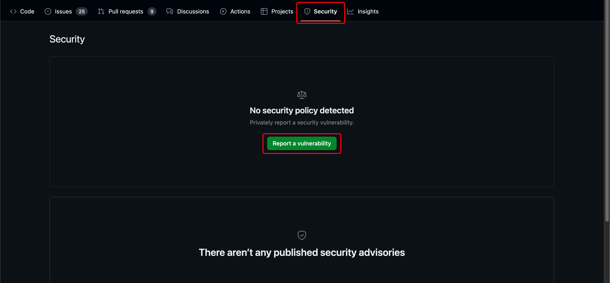

# Security Policy

Thank you for taking the time to report a security vulnerability. We would like to investigate every report thoroughly.

## Reporting a Vulnerability
To report a security vulnerability, please follow these steps:

### Step 1

Navigate to the appropriate reporsitory.

### Step 2

Click on Security and then Report a vulnerability

### Step 3

You can fill in all the details of the vulnerability and click on Submit report. This report will be visible to only the maintainers (and anyone else required to look into the issue).

**Note**: Please do not open a public issue describing the vulnerability.

## When Should You Submit a Report
Please send us a report whenever you:

* Think any of the ORAS projects have a potential security vulnerability.
* Are uncertain if the vulnerability exists or how it might impact our projects.

## Evaluation
The maintainers will acknowledge and analyze your report within 14 working days for high severity issues.

Any vulnerability information you share with us, stays with the maintainers. We will only disclose the information that is required to resolve the problem.

We will update you on the status of the report throughout.

## Fixing the issue
Once a security vulnerability has been identified, the maintainers (contributors, if required) will work on finding a solution. The development and testing for the fix will happen in a private GitHub repository in order to prevent premature disclosure of the vulnerability.

After the fix has been tested and deemed fit to be made public, the changes will be merged from the private GitHub repository to the appropriate public branches. All the necessary binaries will be built and published.

