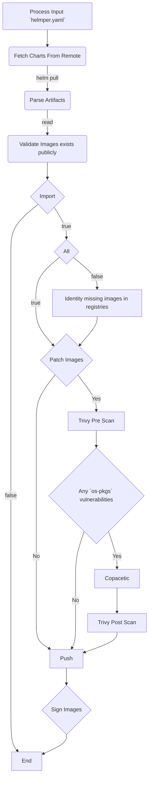

# Configuration Options Diagram

To understand how the different configuration options works, please study the flow diagram below

```mermaid
flowchart TD
    A[Process Input `helmper.yaml`] --> B(Fetch Charts From Remote) 
    
    B -->|helm pull| B1(Parse Artifacts)
    B1 -->|read| B2(Validate Images exists publicly)
    
    B2 --> C{Import}
    C -->|false| End
    C -->|true| C1{All}

    C1 --> |false| C2[Identity missing images in registries]
    C1 --> |true| G{Patch Images}

    C2 --> G

    G -->|Yes| T1[Trivy Pre Scan]
    G -->|No| T6    
    T1 -->T4{Any `os-pkgs` vulnerabilities}
    
    T4 -->|Yes| T5[Copacetic]
    T4 -->|No| T6[Push]
    
    T5 --> T7[Trivy Post Scan]

    T7 --> T6
    T6 --> H{Sign Images}
    H --> End

    End[End]
```