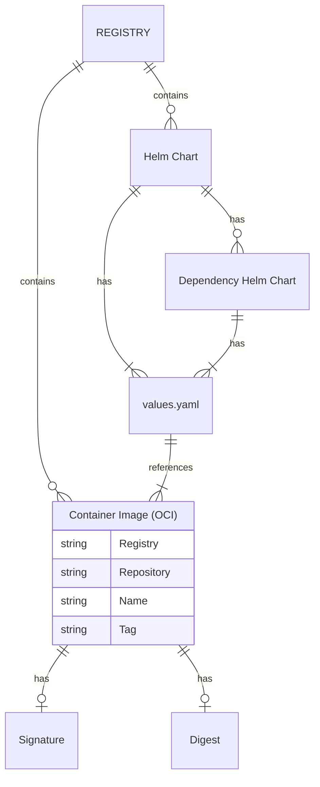

# ER

In the diagram above it can be seen how the different OCI entities relate. This is the structure that Helmper parses and conceptually handles before considering distributing/patching/signing artifacts.

Helmper parses Helm Charts from remote registries, identifies enabled dependency charts and analyses all values.yaml files for references to container images.

