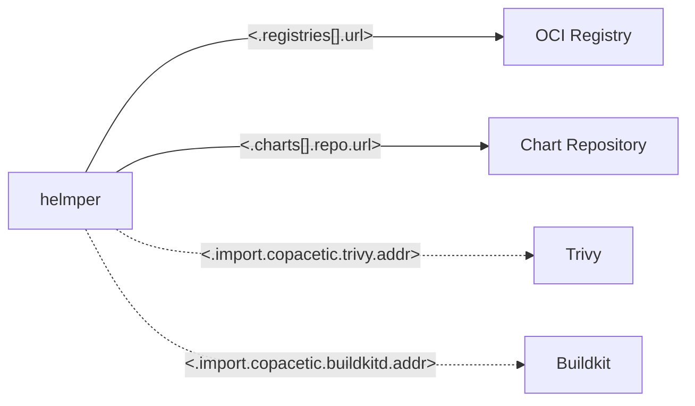

# External services

This diagram illustrates the external services Helmper communicates with. Helmper will always be interacting with OCI registries and Chart repositories. If you have enabled Copacetic in the configuration, Helmper will also communicate with an external Trivy server and Buildkit daemon.

